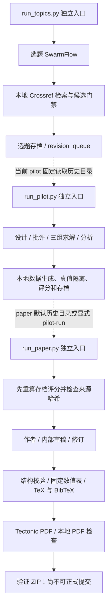

# 当前系统架构

本文相对链接以完整协作仓库为准；历史运行目录、设计稿与独立验证记录不保证全部收入每份 ZIP。压缩包内可用证据应以随包 manifest 的实际文件清单为准。

本文描述已实现且有运行记录的系统，不代表正式参赛验收已完成。研究阶段采用 JiuwenSwarm 的源码扩展与原生 team skill 工作流；不同阶段有独立入口，当前不存在自动贯穿选题、实验、修订、外审、正式提交的单入口闭环。

## 层次与职责

新增开发路径为 [方法修订](../../research/run_method_revision.py) → [协议设计与版本绑定审查](../../research/run_protocol_design.py) → [冻结数据的恢复实验](../../research/run_replay_study.py) → [零 API 复核与事后分析](../../research/analyze_replay.py)。前三者仍使用共用原生运行适配器；CPU 工具在控制代码中重放模型动作，不是开放任意代码执行。各入口仍需显式调用，最新恢复实验尚未接入旧 `run_paper.py` 的特定 pilot 格式。实际记录和无收益结果见 [REVISION.md](../../research/REVISION.md)。

| 层次 | 已实现行为 | 源码 |
| --- | --- | --- |
| 阶段入口与持久化 | 各入口创建运行目录，保存输入、响应、事件、资源与决策；调用方持有预算文件排他锁 | [选题](../../research/run_topics.py)、[pilot](../../research/run_pilot.py)、[论文](../../research/run_paper.py) |
| 团队编排 | SwarmFlow 按顺序调用角色；TeamWorkerBackend 为角色创建 DeepAgent 工作实例；当前并发 cap=1 | [共用运行适配器](../../research/native_runner.py)、[选题 workflow](../../research/skills/topic-discovery/scripts/workflow.py)、[pilot workflow](../../research/skills/pilot-study/scripts/workflow.py)、[论文 workflow](../../research/skills/paper-workflow/scripts/workflow.py) |
| 模型预算源码扩展 | 模型调用前写 admission，返回后记录 usage，跨进程重启读取同一 campaign 账本；异常未配对请求阻止后续调用 | [ResearchBudgetRail](../../jiuwenswarm/jiuwenswarm/agents/harness/common/rails/research_budget_rail.py) |
| 本地可信计算 | 数据和私有真值生成、存档评分重放、引用标识及结构检查、代码生成结果表 | [pilot_benchmark](../../research/pilot_benchmark.py)、[paper_contracts](../../research/paper_contracts.py)、[paper_render](../../research/paper_render.py) |
| 产物与复现 | TeX 转义、真实来源 BibTeX、PDF 检查、白名单 ZIP 与 manifest；依赖固定、官方源码来源保留 | [paper_bundle](../../research/paper_bundle.py)、[依赖锁定](../../setup/requirements.repro.txt)、[编译入口](../../tools/compile-latex.sh) |

选题入口有自己的框架适配实现；pilot 和 paper 使用 `native_runner.py`。该共用适配器注册的研究扩展只有 **ResearchBudgetRail**，另有官方 `core.team.skill_use`。它没有接入 ExperimentEvidenceRail，也没有给研究工作实例开放工具列表；检索、评分和文件校验在 Python 控制代码中完成。

## EvidenceRail 的实际接入范围

[smoke 入口](../../validation/run_smoke.py)是单独的框架验证路径：DeepAgent 调用 `run_queue_experiment`，工具执行固定 CPU 队列实验并返回收据，[ExperimentEvidenceRail](../../jiuwenswarm/jiuwenswarm/agents/harness/common/rails/research_evidence_rail.py)在真实 `after_tool_call` 边界检查成功退出、相对路径、文件 SHA-256 和有限数值指标，并归档收据或拒绝理由。该路径使用自身计量 Rail，不应与研究预算 Rail 混为一谈。

EvidenceRail 证明的是可信本地实验工具所报告文件的完整性与收据符合要求，不证明实验方法正确、命令确实由独立第三方执行或科学结论成立。pilot/paper 的证据约束来自本地校验函数，不是这条 Rail 的覆盖范围。

## 运行模式、预算与恢复边界

- live 使用实际模型 API；offline 替换 `Model.invoke` 为脚本响应，仍走框架编排。选题离线检索也是合成夹具；它们只验证控制流，不产生新的科学观测。
- 预算锁由各命令行调用方使用 `fcntl.flock` 持有，Rail 本身不负责跨进程互斥。使用该类的新调用方必须履行相同契约。
- usage 在响应后取得，总 token 阈值只阻止下一次准入，单次响应可能越过阈值；不是硬费用上限。提示长度只是字符预览，亦不是精确 token 估计。
- 当前研究运行关闭 SDK 与工作流自动重试；失败或缺失 usage 的准入保留，不能通过清空账本自动重跑。
- paper 的 `--resume-run` 重验已保存响应和输入哈希，再编译、打包，不重新请求模型。它保留原失败摘要与恢复记录；不是任意阶段 checkpoint 自动恢复系统。

## 已有证据及未完成项

真实阶段结果见[选题存档](../../research/runs/live-20260928T081927-158480/)、[pilot 存档](../../research/pilot_runs/live-20260928T084134-196833/)、[论文存档](../../research/paper_runs/live-20260928T104912-411414/)。当前 pilot 未支持假设，候选题目未最终确立；论文仍明确标为 Workflow validation draft。

[干净环境记录](clean-environment-validation.json)记录同一 Linux/WSL 主机的新虚拟环境安装、107 项软件检查和原生离线编排成功，以及真实稿重编译文本与 72 dpi 像素一致。它不证明其他操作系统兼容性，也不把脚本模型运行当作独立科学复现。

尚缺新的有效研究论证与实验、跨阶段统一入口及恢复、最终论文对应的 Stanford 外审 Token、正式官方贡献 PR、团队命名与最终提交验收。未来设计见[设计稿](../superpowers/specs/2026-09-28-submission-workflow-design.md)，其中尚未落地部分不能视为当前架构能力。
