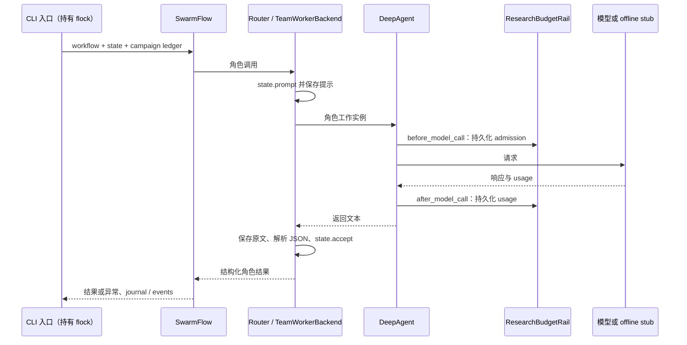

# 当前模块调用说明

本文相对链接以完整协作仓库为准；历史运行目录、设计稿与独立验证记录不保证全部收入每份 ZIP。压缩包内可用证据应以随包 manifest 的实际文件清单为准。

下列入口彼此独立。命令从协作仓库根目录执行，先 `source BDCI/activate.sh`。不带 `--live` 的命令使用脚本模型；不会验证模型研究能力。既有 live campaign 已有预算记录，本文不建议清空账本重跑。

## 选题入口

`python BDCI/research/run_topics.py`

[run_topics.py](../../research/run_topics.py) → [topic-discovery workflow](../../research/skills/topic-discovery/scripts/workflow.py) → `planner` → Python 检索 → `proposer` → Python 定向检索 → `critic` → [contracts.py](../../research/contracts.py)候选门禁。

live 检索由 [literature.py](../../research/literature.py)访问 Crossref 并缓存来源；来源摘要不足则停止。角色返回的数据经过解析，输出 `sources.json`、角色 JSON、`decision.json`、`pilot_handoff.json`、`revision_queue.json` 等。引用可检索并不证明新颖性，`handoff` 也不会自动启动 pilot。

## Pilot 入口

`python BDCI/research/run_pilot.py`

[run_pilot.py](../../research/run_pilot.py)固定读取历史选题目录及 prior-work 检查 → [native_runner.py](../../research/native_runner.py) → [pilot-study workflow](../../research/skills/pilot-study/scripts/workflow.py)：

1. `designer` 修订方案；本地 `validate_plan` 限定实验族为 `integer_arithmetic_v1`、24 题和三次实验角色请求。
2. `critic` 返回是否推进；设计者拒绝或 critic 不推进即提前返回，不执行求解。
3. 本地生成数据、预登记参数和哈希。`peer` 独立求解，`baseline` 与 `intervention` 收到相同公共题目和 peer 答案，分别执行方案中的策略；私有 oracle 不进入 live 求解提示。
4. [pilot_benchmark.py](../../research/pilot_benchmark.py)本地评分，`analyst` 解读测量；程序决策保留样本与研究局限，不把分析者文本当真值。

主要输出为 `pre_registration.json`、`dataset_inputs.json`、`oracle_private.json`、各角色 JSON、`metrics.json`、`decision.json`。`verify_saved_pilot` 以保存的参数重建数据、核对生成器与计划哈希、从存档响应重算指标；这是评分重放，不是再次运行模型或独立重复实验。

## 新方法修订、审查与恢复实验入口

```bash
python BDCI/research/run_method_revision.py
python BDCI/research/run_protocol_design.py
python BDCI/research/run_replay_study.py
python BDCI/research/analyze_replay.py BDCI/research/replay_runs/live-20260928T144804-532140 --verify-only
```

前三条默认脚本模型，不消耗 API；最后一条从冻结源码验证保存的18个实际模型计划及72次策略重放。
方法修订调用 proposer/critic/refiner；协议设计调用 designer/auditor，支持 `--resume-audit` 在新运行目录只重审旧 designer 输出。
审稿输入不含旧版候选，要求目标哈希和逐项原文锚点；它只约束引用对象，不能认证批评逻辑。
恢复实验为18个顺序角色，一例一份计划，四种 CPU 策略共用计划和公开输入；执行后才调用独立评分器。
`research-v2` 24次请求已用满，不要以 `--live` 重复已保存实验。事后追加终止动作的分析独立存档，不覆盖原始结果。

## 历史论文入口与恢复

```bash
python BDCI/research/run_paper.py
python BDCI/research/run_paper.py --pilot-run BDCI/research/pilot_runs/<compatible-run>
python BDCI/research/run_paper.py --resume-run BDCI/research/paper_runs/<existing-run>
```

[PaperState](../../research/run_paper.py)先验证真实 pilot 存档、来源哈希和输入 provenance → [paper-workflow](../../research/skills/paper-workflow/scripts/workflow.py)依次调用 writer、reviewer、reviser → [paper_contracts.py](../../research/paper_contracts.py)检查正文结构、已知引用和逐项回应 → [paper_render.py](../../research/paper_render.py)转义文字、从指标文件生成数值表与 BibTeX → Tectonic 编译 → PDF 文本与结构检查 → [paper_bundle.py](../../research/paper_bundle.py)白名单打包。

writer、reviewer、reviser 是不同角色调用，仍使用同一模型服务；内部审稿不是 Stanford 外审。结构及回应覆盖检查不保证修订语义正确。即使采用 offline 写作，当前入口仍要求来源 pilot 是验证过的真实存档。它不启动任何新实验。

`--resume-run` 只处理已保存的三个原始响应，重新执行契约、来源校验与本地产物步骤；不读 API key，不发模型请求。原始失败保留，新增 `recovery.json`。已有 delivery 不静默覆盖，因此重打包需先显式归档旧生成物。

## 恢复研究论文入口

```bash
python BDCI/research/run_replay_paper.py  # 脚本模型，验证已保存真实实验后走离线写作
```

`replay_paper_evidence.build_evidence` 复验原始与事后实验 → `ReplayPaperState` → replay-paper team skill 的 writer/reviewer/reviser → `replay_paper_render` 从核验表生成正文与表格 → Tectonic。内部 review 绑定 draft/evidence 哈希并要求逐项原文引用，但不保证意见语义正确。

`--continue-from` 只续跑未完成角色，累加先前请求资源；`--resume` 从保存原文重验和编译，零 API；`--editorial-file` 明确标注开发助手编辑。默认最终稿上限1600词是本地工程限制，不是竞赛篇幅要求。已有 writing campaign 3次请求已用完。

`editorial-20260929/` 为保存模型稿的后续本地修订，记录源稿与源PDF哈希，修正复现说明与排版，没有新模型响应。原 live 目录保留完整原始请求与失败记录。

## 共用模型调用链



`native_runner` 仅接入研究 BudgetRail（加官方 skill-use Rail），不接 EvidenceRail。`tools=[]`、单次角色迭代、顺序调度，检索与证据校验由本地控制代码负责。token 停止阈值依赖后反馈，不能保证单次请求不超阈值；usage 亦不是价格账单。`model_summary.json` 在异常路径仍保存当前已知调用与 usage。

## 验证索引

- [真实写作与恢复说明](../../research/PAPER.md)：原始失败、无额外模型调用的恢复、PDF 和 ZIP。
- [pilot 说明](../../research/PILOT.md)：真实负结果与实验局限。
- [干净环境记录](clean-environment-validation.json)：隔离虚拟环境、离线编排、编译与软件检查范围。
- [历史资源审计](historical-resource-audit.json)：四阶段真实历史开发消耗；不是正式作品单次成本。
