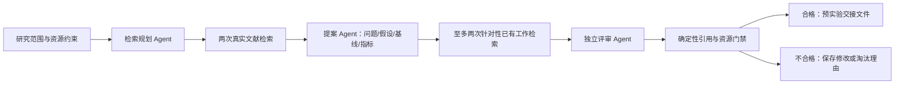

# 自动选题与预实验交接

用户提供研究范围和资源约束，Agent 自行提出课题。本模块基于 JiuwenSwarm/OpenJiuwen 的原生 SwarmFlow、TeamWorkerBackend、TeamHarness/DeepAgent；不是由开发者手工指定论文题目。用户已经确认的设计见 `../docs/superpowers/specs/2026-09-28-topic-discovery-design.md`。



检索客户端使用 Crossref 官方公开 API（https://www.crossref.org/documentation/retrieve-metadata/rest-api/），请求带摘要作品。保存 DOI、标题、作者、年份、摘要、检索词/时间、原始响应及哈希。最多四次查询、每次五条、不重试；结果并非全面综述或质量认证，特别是摘要检索不能证明新颖性。独立评审指单独角色调用与上下文，不代表使用不同模型或没有共同偏差。

## 本轮实际结果（2026-09-28）

运行目录 `runs/live-20260928T081927-158480/`：

- 3 次真实模型请求（DeepSeek deepseek-flash），4 次文献检索，19 条去重论文元数据。
- Agent 自动提出 2 个候选：验证链中同伴抵抗能力与自信度对错误传播的预测关系；信任分数动态角色分配对级联错误的影响。
- 评审对 C1 要求修改，对 C2 否决。前者涉及已有工作重叠、人工错误样本与自然错误的偏差和对照设计；后者涉及已有机制重叠、退化指标未操作化及实验实现问题。
- 确定性门禁结果 `needs_revision`，没有候选获准预实验，也没有最终选题。`pilot_handoff.json` 的 selected_candidate=null、pilot_executed=false、execution_enabled=false。
- `revision_queue.json` 保存修改/替换动作和完整评审理由，不自动消耗下一轮预算。
- 输入 11,593 token、输出 1,887 token，共 **13,480 token**；工作流约20.04秒，不含启动导入。费用未查询；计量来自模型响应 usage，不是账单。
- 评审意见仍是模型判断，不能当成事实证明。例如评审估算请求数量、设计可行性仍须执行器检查；单次批量提示模拟多 Agent 对话也不能证明真实多 Agent 行为。

关键文件：`planner.json`、`sources.json`、`proposer.json`、`critic.json`、`decision.json`、`revision_queue.json`、`pilot_handoff.json`、`summary.json`、`model_usage.jsonl`、`retrieval_events.jsonl`、`workflow_events.jsonl`、`workflow_journal.json` 和 `report.md`。

## 实现与源码贡献

- `skills/topic-discovery/`：三个角色的 Swarm Skill 定义和可执行工作流。
- `run_topics.py`：约束注入、两轮检索、官方后端角色路由、JSON解析、门禁、交接与报告。
- `literature.py`：有界公开元数据检索、缓存、哈希验证和失败计数。
- `contracts.py`：拒绝虚构引用、缺失摘要、重复/缺失评审、超预算或 GPU 需求；资格不代表新颖性证明，永不输出假竞赛分数。
- JiuwenSwarm 源码新增 `jiuwenswarm/agents/harness/common/rails/research_budget_rail.py`：持久 admission、usage、未完成请求与损坏记录阻断。沿用前一阶段实验凭据 Rail，后续执行器可接其验证真实实验产物。

调用方必须在整轮持有 campaign 文件独占锁。API重试、工作流重试、图片自动探测均关闭；模型没有可调用工具。工作流重试通过已固定 agent-core 版本的私有 `_rt` 在开始事件关闭，升级依赖后需要重验。

本轮独立预算文件 `topic-v1-requests.jsonl`，最多3请求，每次最多2200输出token，不能通过重新执行脚本恢复额度。未完成/usage缺失请求同样占额度并阻止继续调用。20000 token 是已知 usage 的后反馈停止阈值，最后一个请求可能跨过，不是硬费用上限。48000字符仅约束 Rail 的上下文预览，不能当成精确token限制。运行总超时360秒。前一轮 `validation/live_requests.jsonl` 保持原样。

## 验证与复现

44 项单元测试通过；真实框架离线正向流程通过。另将额度临时降为2，真实 ResearchBudgetRail 在第三个角色请求前拒绝，实际 admission/usage 均为2，无 critic 或 pilot_handoff 产物。负例结果保存在 `runs/guard-5d3lgoo2/guard_result.json`。

在项目根目录：

```bash
source BDCI/activate.sh
python -m unittest discover -s BDCI/research -p 'test_*.py' -v
python BDCI/research/run_topics.py              # 默认离线，模型响应及文献明确标为 synthetic
python BDCI/research/check_topic_integration.py # 真框架额度负例，无 API
```

本机终端可直接运行；本会话执行沙箱中的 aiofiles 有已确认的线程唤醒限制，真实框架集成测试在沙箱外运行。离线模式不读取密钥，虽然允许模拟候选通过结构门禁，live_pilot_allowed 仍恒为false。所有执行使用独立 run 目录。

真实运行命令是 `python BDCI/research/run_topics.py --live`，但本轮3次请求已经全部使用，重复执行会在调用前被拒绝。不要删除/清空ledger来伪装新预算。模型密钥只从 `../apis.txt` 在运行时读取，未写入代码或报告。未修改 Git 配置、提交或推送。

## 下一阶段

当前完成自动提案、证据初筛与预实验交接；尚未执行这些候选的预实验、获取全文或生成正式论文。下一阶段应让修订 Agent 消化本轮批评，核对最近工作全文，再由具备代码隔离、数据验证、精确请求计数的执行器验证一个可证伪假设。依据真实实验结果保留、修改或放弃课题，然后连接完整实验与 ICLR 论文写作。未经实验确认的候选不能称为最终论文选题。

竞赛论文质量占60%，本阶段门禁优先阻止薄弱课题；系统能力、资源报告和源码贡献保留可审计材料。没有声称已经取得竞赛评分或提交了贡献 PR。
